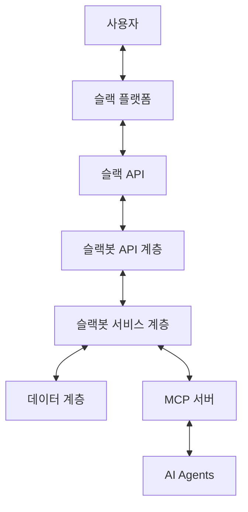

# Design Document

## Overview

슬랙봇은 사용자와 MCP(Mobility Control Platform) 서버 사이의 중개자 역할을 하는 시스템입니다. 이 봇은 슬랙 플랫폼에서 사용자의 메시지를 수신하고, 사용자 ID와 함께 MCP 서버로 중계합니다. 또한 MCP 서버로부터 받은 응답을 다시 사용자에게 전달하는 역할을 합니다. 이 설계 문서는 슬랙봇의 아키텍처, 주요 컴포넌트, 데이터 흐름, 그리고 구현 방법에 대해 설명합니다.

## Architecture

슬랙봇은 다음과 같은 계층적 아키텍처로 구성됩니다:

1. **API 계층**: FastAPI를 사용하여 HTTP 엔드포인트를 제공합니다. 이 계층은 슬랙 이벤트 API로부터 이벤트를 수신하고, MCP 서버로부터의 응답을 처리합니다.

2. **서비스 계층**: 슬랙 API와의 통신, MCP 서버와의 통신, 사용자 세션 관리 등의 비즈니스 로직을 처리합니다.

3. **데이터 계층**: 사용자 정보, 대화 기록 등을 저장하고 관리합니다.

### 아키텍처 다이어그램



## Components and Interfaces

### 1. API 계층 (Controllers)

#### 1.1. SlackEventController

슬랙 이벤트 API로부터 이벤트를 수신하고 처리하는 컨트롤러입니다. `/slack/events` 엔드포인트는 슬랙 서버가 이벤트(메시지, 사용자 참여 등)를 전송하기 위해 호출하는 URL입니다. 이 URL은 슬랙 앱 설정에서 이벤트 구독(Event Subscriptions) URL로 등록되어야 합니다.

```python
@app.post("/slack/events")
async def slack_events(request: Request):
    # 슬랙 이벤트 처리
    # 이벤트 타입에 따라 적절한 서비스 메서드 호출
```

#### 1.2. MCPWebhookController

MCP 서버로부터의 웹훅을 처리하는 컨트롤러입니다.

```python
@app.post("/mcp/webhook")
async def mcp_webhook(request: Request):
    # MCP 서버로부터의 웹훅 처리
    # 사용자에게 알림 메시지 전송
```

### 2. 서비스 계층 (Services)

#### 2.1. SlackService

슬랙 API와의 통신을 담당하는 서비스입니다.

```python
class SlackService:
    def send_message(self, channel_id: str, text: str):
        # 슬랙 API를 사용하여 메시지 전송
    
    def get_user_info(self, user_id: str):
        # 슬랙 API를 사용하여 사용자 정보 조회
```

#### 2.2. MCPService

MCP 서버와의 통신을 담당하는 서비스입니다.

```python
class MCPService:
    def relay_message(self, user_id: str, message: str):
        # 사용자 메시지를 MCP 서버로 중계
    
    def process_webhook(self, webhook_data: dict):
        # MCP 서버로부터의 웹훅 데이터 처리
```

#### 2.3. SessionService

사용자 세션을 관리하는 서비스입니다.

```python
class SessionService:
    def get_or_create_session(self, user_id: str):
        # 사용자 세션 조회 또는 생성
    
    def update_session(self, user_id: str, data: dict):
        # 사용자 세션 업데이트
```

### 3. 데이터 계층 (Models)

#### 3.1. UserModel

사용자 정보를 저장하는 모델입니다.

```python
class UserModel:
    id: str  # 슬랙 사용자 ID
    name: str  # 사용자 이름
    email: str  # 사용자 이메일
    created_at: datetime  # 생성 시간
```

#### 3.2. SessionModel

사용자 세션 정보를 저장하는 모델입니다.

```python
class SessionModel:
    user_id: str  # 사용자 ID
    conversation_state: str  # 대화 상태
    last_interaction: datetime  # 마지막 상호작용 시간
    metadata: dict  # 기타 메타데이터
```

## Data Models

### 1. 슬랙 이벤트 데이터 구조

슬랙 이벤트 API로부터 수신되는 이벤트의 데이터 구조입니다.

```json
{
  "token": "verification_token",
  "team_id": "team_id",
  "api_app_id": "api_app_id",
  "event": {
    "type": "message",
    "channel": "channel_id",
    "user": "user_id",
    "text": "메시지 내용",
    "ts": "timestamp"
  },
  "type": "event_callback",
  "event_id": "event_id",
  "event_time": 1234567890
}
```

### 2. MCP 서버로 전송되는 데이터 구조

슬랙봇이 MCP 서버로 중계하는 메시지의 데이터 구조입니다.

```json
{
  "user_id": "slack_user_id",
  "user_name": "사용자 이름",
  "message": "원본 메시지 내용",
  "timestamp": "메시지 타임스탬프",
  "channel_id": "메시지가 수신된 채널 ID"
}
```

### 3. MCP 서버로부터 수신되는 웹훅 데이터 구조

MCP 서버가 슬랙봇으로 전송하는 웹훅의 데이터 구조입니다.

```json
{
  "user_id": "slack_user_id",
  "message": "사용자에게 전달할 메시지",
  "event_type": "이벤트 타입 (예: ride_assigned, ride_cancelled)",
  "metadata": {
    "추가 정보": "값"
  }
}
```

## Error Handling

슬랙봇은 다음과 같은 오류 처리 전략을 사용합니다:

1. **슬랙 API 오류**: 슬랙 API와의 통신 중 발생하는 오류는 로깅하고, 재시도 메커니즘을 구현합니다.

2. **MCP 서버 통신 오류**: MCP 서버와의 통신 중 발생하는 오류는 로깅하고, 사용자에게 적절한 오류 메시지를 제공합니다.

3. **데이터 검증 오류**: 수신된 데이터의 유효성 검증에 실패한 경우, 로깅하고 적절한 오류 응답을 반환합니다.

4. **예외 처리**: 예상치 못한 예외가 발생한 경우, 전역 예외 핸들러를 통해 로깅하고 적절한 오류 응답을 반환합니다.

```python
@app.exception_handler(Exception)
async def global_exception_handler(request: Request, exc: Exception):
    # 예외 로깅
    logger.error(f"Unexpected error: {exc}")
    # 적절한 오류 응답 반환
    return JSONResponse(
        status_code=500,
        content={"message": "Internal server error"}
    )
```

## Testing Strategy

슬랙봇의 테스트 전략은 다음과 같습니다:

1. **단위 테스트**: 각 서비스 및 컴포넌트의 기능을 독립적으로 테스트합니다.

2. **통합 테스트**: 여러 컴포넌트 간의 상호작용을 테스트합니다.

3. **엔드투엔드 테스트**: 실제 슬랙 API 및 MCP 서버와의 통신을 테스트합니다.

4. **모의 객체(Mock) 사용**: 외부 의존성(슬랙 API, MCP 서버)을 모의 객체로 대체하여 테스트합니다.

```python
def test_slack_service_send_message():
    # 슬랙 API 클라이언트를 모의 객체로 대체
    mock_client = MagicMock()
    service = SlackService(client=mock_client)
    
    # 메시지 전송 테스트
    service.send_message("channel_id", "test message")
    
    # 모의 객체가 올바르게 호출되었는지 확인
    mock_client.chat_postMessage.assert_called_once_with(
        channel="channel_id",
        text="test message"
    )
```

## Security Considerations

슬랙봇의 보안 고려사항은 다음과 같습니다:

1. **인증 및 권한 부여**: 슬랙 API 및 MCP 서버와의 통신 시 적절한 인증 메커니즘을 사용합니다.

2. **데이터 암호화**: 민감한 정보(사용자 ID, 위치 정보 등)는 전송 및 저장 시 암호화합니다.

3. **입력 검증**: 모든 사용자 입력 및 API 응답을 검증하여 주입 공격을 방지합니다.

4. **API 키 관리**: 슬랙 API 키 및 MCP 서버 API 키는 환경 변수 또는 안전한 비밀 관리 서비스를 통해 관리합니다.

5. **로깅 및 모니터링**: 보안 관련 이벤트를 로깅하고 모니터링하여 잠재적인 보안 위협을 탐지합니다.

## Implementation Details

### 1. 프로젝트 구조

```
chatbot/
├── app/
│   ├── __init__.py
│   ├── main.py                # FastAPI 애플리케이션 설정
│   ├── controllers/
│   │   ├── __init__.py
│   │   ├── slack_controller.py  # 슬랙 이벤트 처리 컨트롤러
│   │   └── mcp_controller.py    # MCP 웹훅 처리 컨트롤러
│   ├── services/
│   │   ├── __init__.py
│   │   ├── slack_service.py     # 슬랙 API 통신 서비스
│   │   ├── mcp_service.py       # MCP 서버 통신 서비스
│   │   └── session_service.py   # 사용자 세션 관리 서비스
│   ├── models/
│   │   ├── __init__.py
│   │   ├── user.py              # 사용자 모델
│   │   └── session.py           # 세션 모델
│   └── utils/
│       ├── __init__.py
│       ├── logger.py            # 로깅 유틸리티
│       └── config.py            # 설정 관리 유틸리티
├── tests/
│   ├── __init__.py
│   ├── test_controllers/
│   ├── test_services/
│   └── test_models/
├── slackbot.py                # 애플리케이션 진입점
└── requirements.txt           # 의존성 목록
```

### 2. 주요 의존성

- **FastAPI**: 웹 API 프레임워크
- **Slack SDK**: 슬랙 API와의 통신
- **Requests**: HTTP 클라이언트
- **Pydantic**: 데이터 검증 및 설정 관리
- **SQLAlchemy** (선택 사항): 데이터베이스 ORM
- **Pytest**: 테스트 프레임워크

### 3. 설정 관리

환경 변수 또는 설정 파일을 통해 다음과 같은 설정을 관리합니다:

```python
class Settings(BaseSettings):
    # 슬랙 API 설정
    SLACK_BOT_TOKEN: str
    SLACK_SIGNING_SECRET: str
    
    # MCP 서버 설정
    MCP_API_URL: str
    MCP_API_KEY: str
    
    # 애플리케이션 설정
    LOG_LEVEL: str = "INFO"
    DATABASE_URL: Optional[str] = None
    
    class Config:
        env_file = ".env"
```

### 4. 로깅 설정

구조화된 로깅을 위해 Python의 기본 로깅 모듈을 사용합니다:

```python
import logging
import sys

def setup_logger():
    logger = logging.getLogger("slackbot")
    logger.setLevel(logging.INFO)
    
    handler = logging.StreamHandler(sys.stdout)
    handler.setFormatter(logging.Formatter(
        "%(asctime)s - %(name)s - %(levelname)s - %(message)s"
    ))
    
    logger.addHandler(handler)
    return logger

logger = setup_logger()
```

## Deployment Considerations

슬랙봇의 배포 고려사항은 다음과 같습니다:

1. **컨테이너화**: Docker를 사용하여 애플리케이션을 컨테이너화합니다.

2. **CI/CD**: GitHub Actions 또는 Jenkins를 사용하여 지속적 통합 및 배포 파이프라인을 구축합니다.

3. **확장성**: 수평적 확장을 위해 무상태(Stateless) 설계를 채택합니다.

4. **모니터링**: Prometheus 및 Grafana를 사용하여 애플리케이션 성능 및 상태를 모니터링합니다.

5. **로그 관리**: ELK 스택 또는 클라우드 로깅 서비스를 사용하여 로그를 중앙 집중화합니다.

### Dockerfile 예시

```dockerfile
FROM python:3.9-slim

WORKDIR /app

COPY requirements.txt .
RUN pip install --no-cache-dir -r requirements.txt

COPY . .

CMD ["python", "slackbot.py"]
```

## Future Enhancements

향후 개선 사항은 다음과 같습니다:

1. **메시지 큐 도입**: 대규모 트래픽 처리를 위해 RabbitMQ 또는 Kafka와 같은 메시지 큐를 도입합니다.

2. **캐싱 레이어 추가**: Redis를 사용하여 자주 액세스하는 데이터를 캐싱합니다.

3. **다국어 지원**: 다양한 언어로 사용자와 상호작용할 수 있도록 다국어 지원을 추가합니다.

4. **슬랙 UI 요소 활용**: 버튼, 드롭다운 메뉴 등의 슬랙 UI 요소를 활용하여 사용자 경험을 개선합니다.

5. **분석 및 보고**: 사용자 상호작용 데이터를 수집하고 분석하여 서비스 개선에 활용합니다.